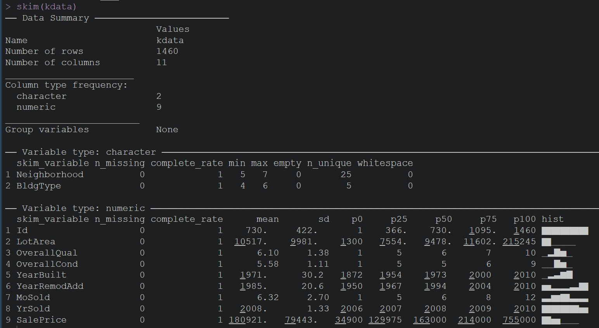

[](https://example.com)


# ```Kaggle | Boston Housing Dataset```

<hr>

This project was created to explore the Kaggle dataset [House_Prices](https://www.kaggle.com/competitions/house-prices-advanced-regression-techniques) and to implement machine learning techniques using R.

| Task | Status |
|---------|--------|
| 1 - Target Variables | Complete |
| 2 - ML implementation | Complete |
| 3 - Shiny Web App | Complete |


### <font color = "red">Objective:</font> 

- We are not competing with other teams on kaggle
- This project is a playground to practice the knowledge of this class and prepare for the final exam.
- Group project, 1-3 people per team. You can be your own team. 
- You can use `R` or Python
- Build one prediction model using the ML algorithms of this course
- Evaluate your prediction model
- Try different ways to improve your model and show the improvements.
- Submit code and results in Jupyter and `HTML` formats on canvas


### <font color = "red">Chosen dataset variables:</font>	

|  | Name | Data Type |
|---|------|-----------|
|01 | BldgType | Chr |
|02 | Neighborhood | Chr |
|03 | Lot Area | Int |
|04 | OverallQual | Int |
|05 | OverallCond | Int |
|06 | YearBuilt | Int |
|07 | YearRemodAdd | Int |
|08 | MoSold | Int |
|09 | YrSold | Int |
|10 | SalePrice | Int |

- Rows: 1461
- Categorical Variables: 2
- Numerical Variables: 9

The description of the dataset contains the following information:


